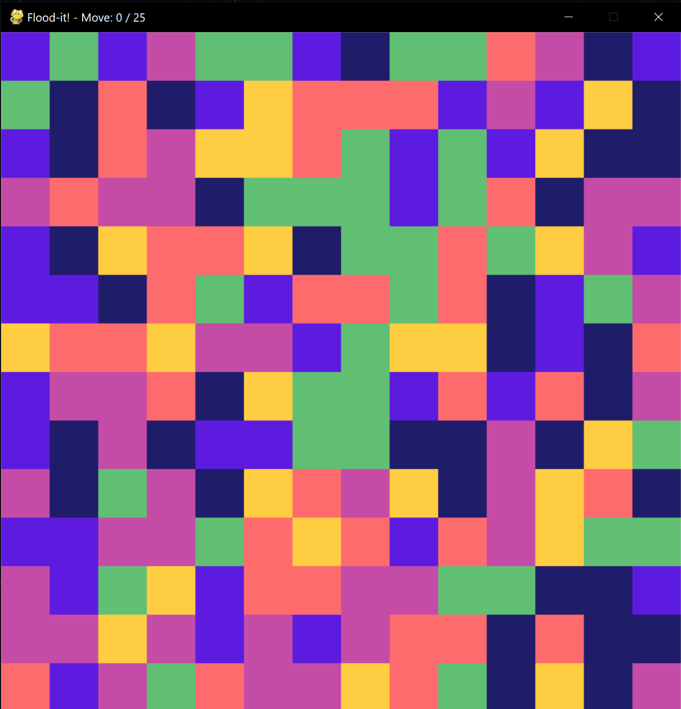

# Pygame Flood-It!
Flood-it game implementation with the pygame engine. 



# Rules 
Flood It is a popular and engaging strategy board game that challenges players to fill the entire game board with a single color in the fewest moves possible. 
1. Game Setup:
- The game board is initially filled with different colors.
- Players are given a set number of moves to complete the task.
2. Turns:
- On each turn, a player selects a color.
- All cells connected to the initially selected cell (either horizontally or vertically) will change to the chosen color.
- The player's score is based on the number of moves it takes to flood the entire board.
3. Winning:
- The game is won when the entire board is flooded with the chosen color.
- Players aim to achieve this goal in as few moves as possible.


# Install
```shell
pip install -r requirements.txt
```

# Run
```bash
python main.py
```

# Create Exe
````bash
# pip install pyinstaller
pyinstaller --onefile --name flood_it --noconsole main.py
````

# Play online
https://unixpapa.com/floodit/